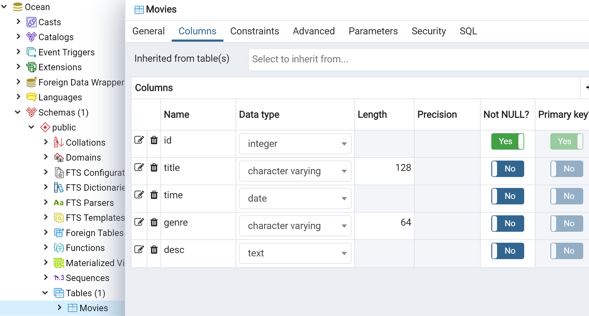
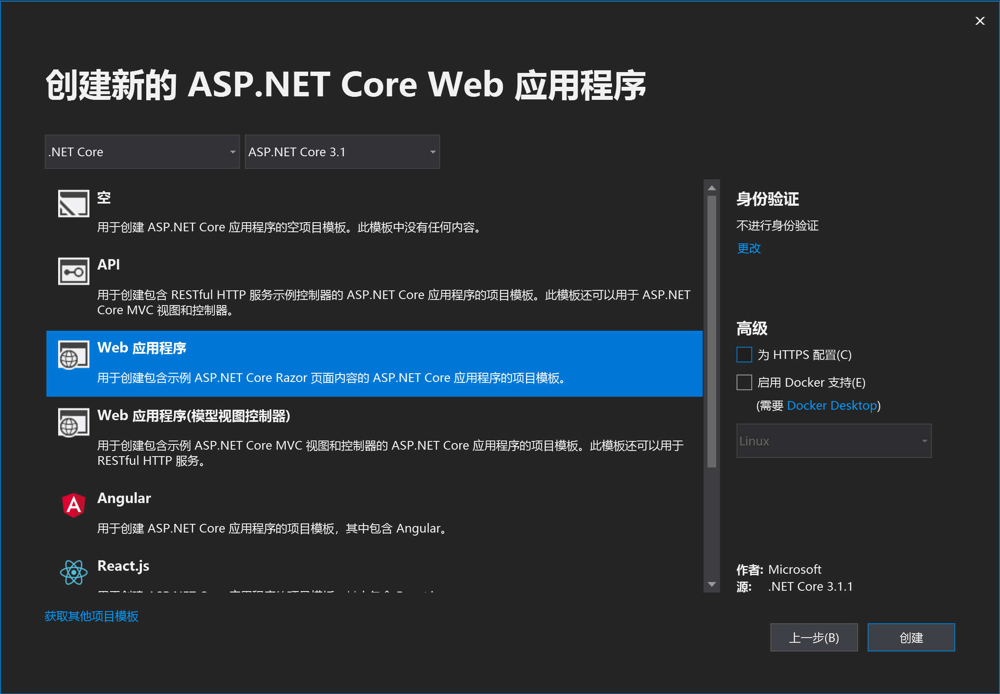
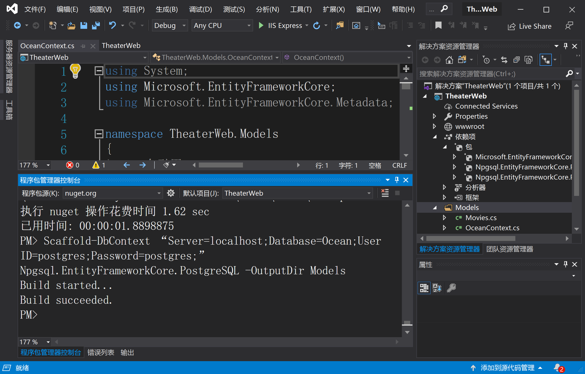
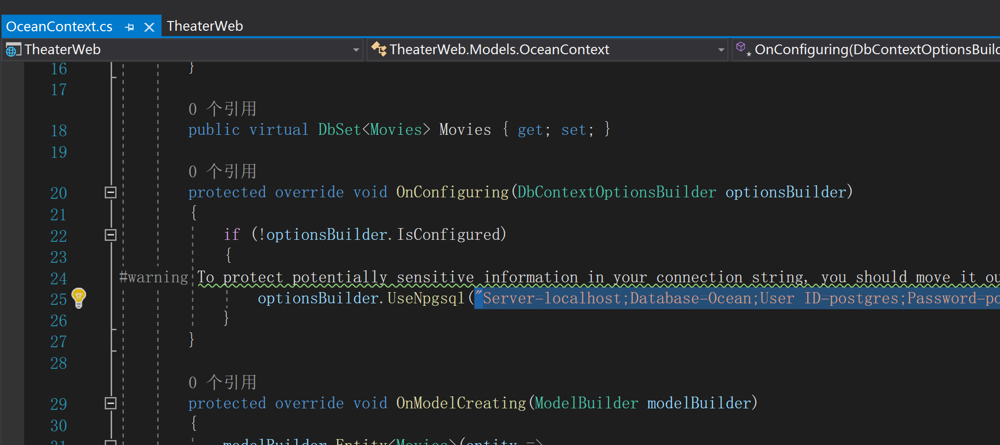
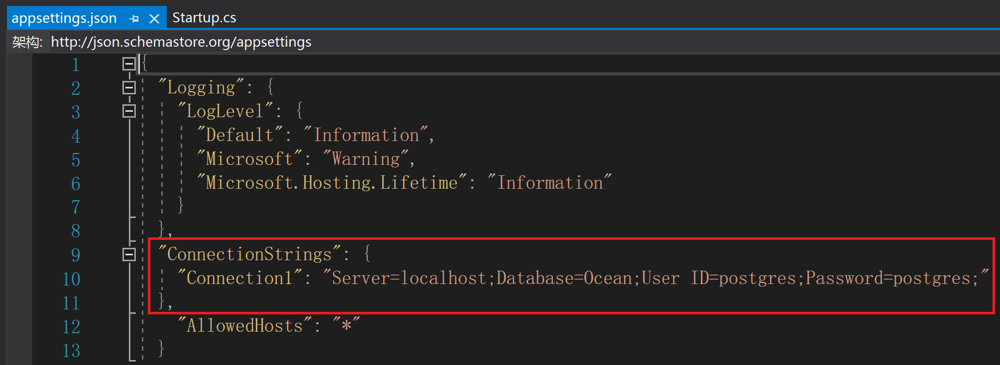
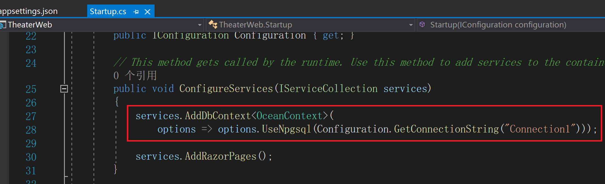
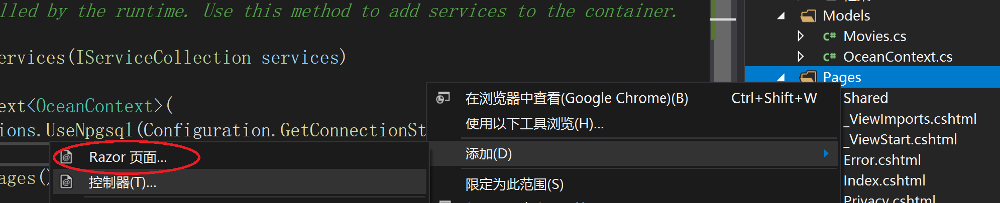
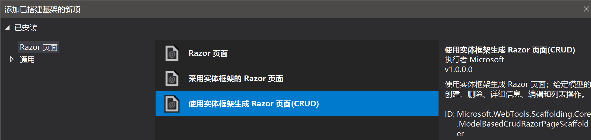
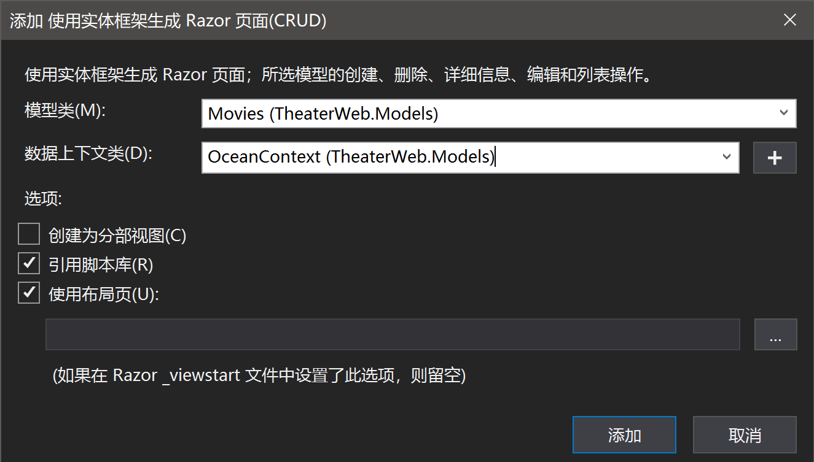
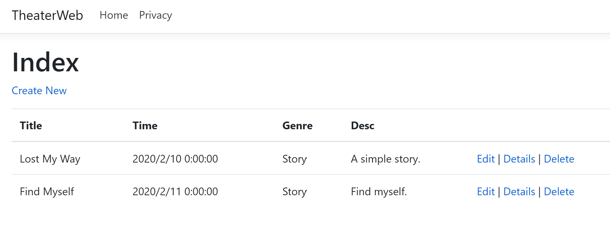

# TheaterWeb #

[TOC]

## Intro ## 

ASP .NET Core Web App (.NET Core 3.1) with PostgreSQL 10 Database

*Visual Studio 2019* (version 16.4.4 or higher) on Windows 10


## Step-by-Step ##

### 0.PostgreSQL Database ###

**Create a database named `Ocean` using `pgAdmin` or other tools**

 


### 1. Create a New ASP .NET Core Web Application ###

**Select `.NET Core` `ASP.NET Core 3.1`**




### 2. Prepare Data Models ###


**2.1. Install Packages (`EF Core` and `Npgsql`)**


Install these packages one by one in `PM>`

```
Install-Package Npgsql.EntityFrameworkCore.PostgreSQL

Install-Package Npgsql.EntityFrameworkCore.PostgreSQL.Design

Install-Package Microsoft.EntityFrameworkCore.Tools
```


**2.2. Scaffold DB Context**


Firstly, create the output folder (*Models*), then type the script below in `PM>`

```
Scaffold-DbContext “Server=localhost;Database=Ocean;User ID=postgres;Password=postgres;” Npgsql.EntityFrameworkCore.PostgreSQL -OutputDir Models
```





### 3. Connection Settings ###


**3.1. Remove the override method `DbContext.OnConfiguring`**




**3.2. Edit App Settings**


`appsettings.json` *ConnectionStrings* and `Startup.ConfigureServices`







### 4. Add New Razor Page ###

**4.1. Right click on the `Pages` folder, `Add` --> `Razor Page`**




**4.2. Select `Using Entity Framework to Generate Razor Page (CRUD)`**




**4.3. Select `Model` and `Data Context` as below**




**4.4. Then click `Add`, required packages can be automatically installed. **


### 5. Run in a browser (maybe Chrome) ###


Screenshot like this:


