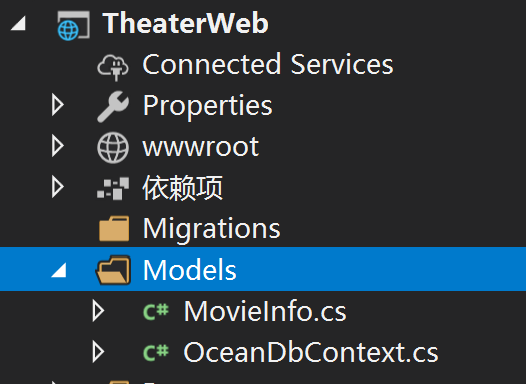
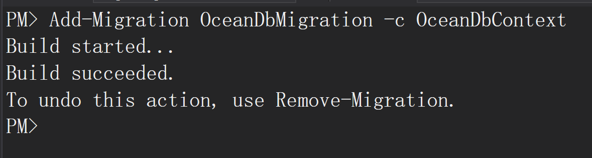
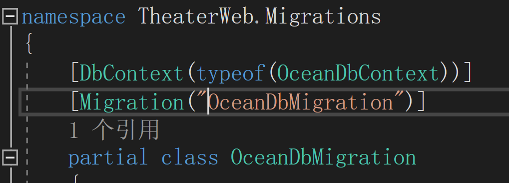

# TheaterWeb #

[TOC]

## Intro ## 

ASP .NET Core Web App (.NET Core 3.1) with PostgreSQL 10 Database

*Visual Studio 2019* (version 16.4.4 or higher) on Windows 10


## Step-by-Step : Database First  ##

### 1. PostgreSQL Database ###

**Create a database named `Ocean` using `pgAdmin` or other tools**

 


### 2. Create a New ASP .NET Core Web Application ###

**Select `.NET Core` `ASP.NET Core 3.1`**


### 3. Prepare Data Models ###


**3.1. Install Packages (`EF Core` and `Npgsql`)**


Install these packages one by one in `PM>`

```
Install-Package Npgsql.EntityFrameworkCore.PostgreSQL

Install-Package Npgsql.EntityFrameworkCore.PostgreSQL.Design

Install-Package Microsoft.EntityFrameworkCore.Tools
```


**3.2. Scaffold DB Context**


Firstly, create the output folder (*Models*), then type the script below in `PM>`


```
Scaffold-DbContext “Server=localhost;Database=Ocean;User ID=postgres;Password=postgres;” 
Npgsql.EntityFrameworkCore.PostgreSQL -OutputDir Models
```


### 4. Connection Settings ###


**4.1. Remove the override method `DbContext.OnConfiguring`**


**4.2. Edit App Settings**


Edit `appsettings.json` *ConnectionStrings* and `Startup.ConfigureServices`


### 5. Add New Razor Page ###

**5.1. Right click on the `Pages` folder, `Add` --> `Razor Page`**


**5.2. Select `Using Entity Framework to Generate Razor Page (CRUD)`**


**5.3. Select `Model` and `Data Context` as below**


**5.4. Then click `Add`, the required packages will be automatically installed.**

Wait for a few seconds before it done.

### 6. Run in a browser (maybe Chrome) ###


Screenshot like this:


## Step-by-Step : Code First  ##

### 1. Create a New ASP .NET Core Web Application ###


**Select `.NET Core` `ASP.NET Core 3.1`**


*Steps are the same as the previous*


### 2. Prepare Data Models ###


**2.1. Install Packages (`EF Core` and `Npgsql`)**


*Steps are the same as the previous*


**2.2. Data Models definition**


Create the output folder (*Models*), then write your code (definitions) for Data Models and  `XXDbContext` 





### 3. Connection Settings ###

Edit `appsettings.json` *ConnectionStrings* and `Startup.ConfigureServices`


*Steps are the same as the previous*


### 4. Add Migration ###


**4.1 Build Models**

Type in the PM console:


```
Add-Migration OceanDbMigration -c OceanDbContext
```





You can rename the generated class name, and remember this annotation:





**4.2 Update Database**


This can be done by typing in the PM console:


```
Update-Databse
```


Or run `Migration` in your code:


```
// check the Db exists or not
// XXDbContext.Database.CanConnect()
// XXDbContext.Database.CanConnectAsync()

// Do migration
XXDbContext.Database.Migration()
//XXDbContext.Database.MigrationAsync()
```


### 5. Add New Razor Page ###


*Steps are the same as the previous*


### 6. Run in a browser (maybe Chrome) ###

*Steps are the same as the previous*

